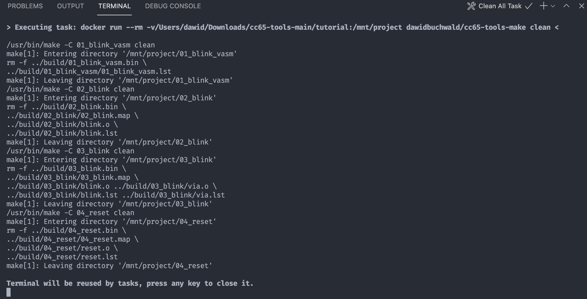

# Migration from Vasm to CC65

Ben Eater's 6502 videos are great place to start with homebrew 6502 builds, but some of the choices he made are, well, debatable, and one that I would like to address here is using Vasm compiler for building system firmware. Sure, given the scope of the original project it makes sense - it's a simple tool with almost no requirements for understanding modern development toolchains.

That being said, this simplicity comes at a cost - code written for Vasm is not very portable across different devices, and while it can be addressed with some smart tricks and hacks, it's not a proper way to go. Thing is: after a while, when you have quite a lot of source code already written for Vasm it's more and more difficult to switch and you end up locked in with a product that doesn't scale very well.

Another important issue is that the value of the compiler lies in the source code available for it and some notable projects (like 1978 Microsoft BASIC or KIM-1 MicroChess) can't be compiled with Vasm without serious possibly error-prone porting effort.

So, using more "mature" toolchain like CC65 is recommended, even (or maybe especially, to avoid migration backtracking) at the beginning of 6502 adventure. It provides much better and based on best practices "separation of concerns" approach to building software and is used widely for many projects, including modern ones like Commander X16 (or was it ChickenLips?). As long as you have experience in building software in Linux/MacOS environment it is pretty straightforward to use, but for less experienced and/or Microsoft Windows users the initial setup might be overwhelming. 

Since I deeply care about 6502 community and I believe even the newcomers will benefit from the switch to CC65 toolchain, I decided to make the transition for them a bit easier.

So, if you watched Ben's 6502 videos, liked what you saw, and you want to take your 6502 development to the next level, this tutorial is for you. I hope it will make your life easier.

## Software installation

If you are using Linux/MacOS and you have some experience of compiling applications from sources, you should be fine with installing tools like `md5sum`,`make`, `git`, cloning CC65 repo and building it. In Windows environment it's a bit more complicated (I suggest Cygwin64 for it), but there is alternative approach which I will use in this tutorial.

One of the best approaches to running software like CC65 (which is very Unix-specific) is packaging it in entity called "container", which is basically portable application package capable of delivering very specific functionality in isolated sandbox. This way you can have specific Unix software running in your Windows/Linux/MacOS system the very same way. Pretty convenient, right?

Obviously, you need to start with installing software that will be able to run these "containers", and that software is Docker. It's free, open source tool and de facto standard for contenerized applications. You can download it from [Docker Desktop website](https://www.docker.com/products/docker-desktop) for your operating system. Follow installation instructions, and when completed, you have to be able to run the following command in your terminal (Command Prompt/Shell/PowerShell/etc.):

`docker run hello-world`

Most likely you will run this command during or shortly after the installation. You expect the following output:

````
➜  ~ docker run hello-world
Unable to find image 'hello-world:latest' locally
latest: Pulling from library/hello-world
b8dfde127a29: Pull complete
Digest: sha256:9f6ad537c5132bcce57f7a0a20e317228d382c3cd61edae14650eec68b2b345c
Status: Downloaded newer image for hello-world:latest

Hello from Docker!
This message shows that your installation appears to be working correctly.

To generate this message, Docker took the following steps:
 1. The Docker client contacted the Docker daemon.
 2. The Docker daemon pulled the "hello-world" image from the Docker Hub.
    (amd64)
 3. The Docker daemon created a new container from that image which runs the
    executable that produces the output you are currently reading.
 4. The Docker daemon streamed that output to the Docker client, which sent it
    to your terminal.

To try something more ambitious, you can run an Ubuntu container with:
 $ docker run -it ubuntu bash

Share images, automate workflows, and more with a free Docker ID:
 https://hub.docker.com/

For more examples and ideas, visit:
 https://docs.docker.com/get-started/
````

Some details can be different, depending on your operating system/CPU, but this is the general idea. If there are any errors, you have to resolve them before moving forward. In Windows you might have to start the Docker Desktop application manually the first time (it will show up in your Start Menu). Congratulations, you are good to go!

## Downloading CC65 Docker image

This step is optional, but I just wanted to take it easy and move in small increments. If you skip it, Docker will download CC65 image automatically during first execution later on. Oh, and don't worry about the cryptic commands, I will explain them as we go on.

Try running the following command:

`docker run --rm dawidbuchwald/cc65-tools-make --version`

It should take several minutes to download approximately 400MB worth of data, and display the following output:

````
docker run --rm dawidbuchwald/cc65-tools-make --version
Unable to find image 'dawidbuchwald/cc65-tools-make:latest' locally
latest: Pulling from dawidbuchwald/cc65-tools-make
5843afab3874: Already exists
948c5cee294c: Already exists
9c488575ea4b: Already exists
7ef3b97731bc: Already exists
b3c35c8bf072: Already exists
089c659f74ff: Already exists
4f4fb700ef54: Already exists
Digest: sha256:ee1a199ca6222c65cf2cdaa5fcdf839eae63916644312cad209dfaf4cbbe57e9
Status: Downloaded newer image for dawidbuchwald/cc65-tools-make:latest
GNU Make 4.3
Built for x86_64-alpine-linux-musl
Copyright (C) 1988-2020 Free Software Foundation, Inc.
License GPLv3+: GNU GPL version 3 or later <http://gnu.org/licenses/gpl.html>
This is free software: you are free to change and redistribute it.
There is NO WARRANTY, to the extent permitted by law.
````

If this command fails, try running the `docker run hello-world` again to check if your Docker installation is running correctly. If it is, the above command should just work.

## Getting tutorial source code and building it

Now, if you are familiar with `git` just clone the repo. If not, don't worry, you can download the sources directly from GitHub page. Follow this link to download it:

[GitHub link to CC65 migration tutorial](https://github.com/dbuchwald/cc65-tools/archive/refs/heads/main.zip)

You will get `cc65-tools-main.zip` file. Save it in location of your choice (I suggest something simple, as you will have to go to this directory in your Command Prompt) and extract. In my case I saved it to `Downloads` folder and extracted it to `Downloads/cc65-tools-main/tutorial` folder. Go to this location using your Terminal/Shell/Command Prompt:

````
➜  ~ cd Downloads
➜  Downloads cd cc65-tools-main
➜  cc65-tools-main ls -l
total 32
-rw-rw-r--@  1 dawid  staff  11357 Jul  8 17:55 LICENSE
-rw-rw-r--@  1 dawid  staff     45 Jul  8 17:55 README.md
drwxrwxr-x@  3 dawid  staff     96 Jul  8 17:55 cc65-tools-base
drwxrwxr-x@  3 dawid  staff     96 Jul  8 17:55 cc65-tools-make
drwxrwxr-x@  3 dawid  staff     96 Jul  8 17:55 cc65-tools-vasm
drwxrwxr-x@ 10 dawid  staff    320 Jul  8 17:55 tutorial
➜  cc65-tools-main cd tutorial
➜  tutorial ls -l
total 8
drwxrwxr-x@ 4 dawid  staff  128 Jul  8 17:55 01_blink_vasm
drwxrwxr-x@ 5 dawid  staff  160 Jul  8 17:55 02_blink
drwxrwxr-x@ 6 dawid  staff  192 Jul  8 17:55 03_blink
(...)
drwxrwxr-x@ 6 dawid  staff  192 Jul  8 17:55 common
-rw-rw-r--@ 1 dawid  staff  427 Jul  8 17:55 makefile
➜  tutorial
````

Please note: I'm typing this tutorial on MacOS with zsh, so the layout of your shell/terminal/command prompt might be different. The point is that you want to end up in `cc65-tools-main/tutorial` folder and see the list of folders similar to above. When you reach this point run the following command (replacing `/Users/dawid/Downloads/cc65-tools-main/tutorial` with your current path, if you don't know it, you can retrieve it with `pwd` command in Linux/MacOS or `cd` without arguments in Windows):

`docker run --rm -v/Users/dawid/Downloads/cc65-tools-main/tutorial:/mnt/project dawidbuchwald/cc65-tools-make test` 

You expect the output to be similar to this one:

````
➜  tutorial docker run --rm -v/Users/dawid/Downloads/cc65-tools-main/tutorial:/mnt/project dawidbuchwald/cc65-tools-make test
/usr/bin/make -C 01_blink_vasm all
make[1]: Entering directory '/mnt/project/01_blink_vasm'
vasm6502_oldstyle -Fbin -dotdir -o ../build/01_blink_vasm.bin -L ../build/01_blink_vasm/01_blink_vasm.lst blink.s
vasm 1.8k (c) in 2002-2021 Volker Barthelmann
vasm 6502 cpu backend 0.9c (c) 2002,2006,2008-2012,2014-2021 Frank Wille
vasm oldstyle syntax module 0.16 (c) 2002-2021 Frank Wille
vasm binary output module 2.1 (c) 2002-2021 Volker Barthelmann and Frank Wille

seg8000(acrwx1):	          17 bytes
segfffc(acrwx1):	           4 bytes
make[1]: Leaving directory '/mnt/project/01_blink_vasm'
/usr/bin/make -C 02_blink all
make[1]: Entering directory '/mnt/project/02_blink'
ca65 --cpu 65C02  -o ../build/02_blink/blink.o -l ../build/02_blink/blink.lst blink.s
ld65  -C firmware.cfg -o ../build/02_blink.bin -m ../build/02_blink/02_blink.map ../build/02_blink/blink.o
make[1]: Leaving directory '/mnt/project/02_blink'
/usr/bin/make -C 03_blink all
make[1]: Entering directory '/mnt/project/03_blink'
ca65 --cpu 65C02  -o ../build/03_blink/blink.o -l ../build/03_blink/blink.lst blink.s
ca65 --cpu 65C02  -o ../build/03_blink/via.o -l ../build/03_blink/via.lst via.s
ld65  -C firmware.cfg -o ../build/03_blink.bin -m ../build/03_blink/03_blink.map ../build/03_blink/blink.o ../build/03_blink/via.o
make[1]: Leaving directory '/mnt/project/03_blink'
(...)
762bda266c36142c0da217d034f813c4  build/01_blink_vasm.bin
762bda266c36142c0da217d034f813c4  build/02_blink.bin
762bda266c36142c0da217d034f813c4  build/03_blink.bin
(...)
````

If this worked in a similar manner, it means that you have your full CC65 toolchain working as a charm, and you are ready to go.

## Explanation of the `docker run` command used above

Now, you can skip this section, but I suggest you take the time to read and understand it. It will help you out in future when troubleshooting potential build issues. Let's start with explanation what has just happened and how this container works.

Basically, when you start the cc65-tools-make container, it runs very small, lightweight Linux-based "almost-operating-system" that contains all the components required for building software using CC65: `cc65` compiler, `ld65` linker, `make` build orchestrator and even `vasm6502_oldstyle` compiler (for Ben's sources). All these tools are pre-packaged, but the source code is not in the container itself, and you don't want it there. You want to be able to use your own operating system with its desktop software, code editor of your choice and so on to write the code, but allow the container to access it, compile and produce binary files to upload to your ROM later on. The container will pick up the source code, compile it according to provided `makefile` and exit.

Another thing is that you want all the compilation artifacts (listing, object, map and bin files) to be available after the process completes, but all the container internal stuff to be discarded to preserve your disk space.

With that explanation, let's look at the `docker run` command syntax again:

````
docker run                                          (1)
  --rm                                              (2)
  -v                                                (3)
    /Users/dawid/Downloads/cc65-tools-main/tutorial (4)
    :                                               (5)
    /mnt/project                                    (6)
  dawidbuchwald/cc65-tools-make                     (7)
  test                                              (8)
````

Here is what each of these parameters means:

1. `docker run` is a command used to run containers; `docker` utility has plenty of other commands you can use to list existing containers, images and so on,
2. `--rm` parameter is passed to `run` command and it enforces removal of all temporary container files (not related to the compilation) created during execution,
3. `-v` parameter is passed to `run` command to indicate volume (point in your filesystem, location on your disk) that has to be visible inside the container. This is where the container will pick up the sources from and this is where it will save compilation results,
4. `/Users/dawid/Downloads/cc65-tools-main/tutorial` is the path on your disk where the source code is located and where the compilation results will be saved,
5. `:` is the separator between source and target path for volume mapping,
6. `/mnt/project` is a virtual location in the container, and this is where the container will look for source code to compile,
7. `dawidbuchwald/cc65-tools-make` is the name of the container image to be executed. Everything passed after container image name will no longer be treated as parameter to `run` command, but will be passed to the container itself,
8. `test` is the first and only parameter we pass to the container, and it tells the container to recompile all the source code and calculate MD5 sum for each of the generated ROM bin files. There are other parameters that can be passed and depending on the context they will have a different effect.

See? Wasn't that difficult, was it?

The very important point to remember is the order of parameters: everything before the image name is considered as parameter to `docker run` command and everything after it will be passed on to container as execution parameters.

## Important security notice

There is one thing you have to consider: when you run container with volume mapping like in the example above, you provide full access to the indicated path, and for a good reason: you want the container to be able to create compilation artifacts (objects, listings, map and bin files). That being said, remember that any mistake you make in your `makefile` or in the parameters passed to execution can result in potentially catastrophic consequences for the data in the folder. Container can't "go up" and delete everything from your filesystem, but anything stored in the mapped folder can be deleted or otherwise altered. Be careful and keep a copy of your source code elsewhere (preferably in some remote location). Using SCM tools (like `git` is also recommended, but this is another story altogether).

## Making your life just a bit easier

OK, you managed to build the source code and you have your ROM bin files ready, but typing in these long commands gets old very fast. That's why I would like to show you another tool that will make following the tutorial much easier. Please note: this step is also optional, and if you prefer to use different code editor, go ahead, but take a while to see how I automated build process in VSCode. You might be able to use the same pattern in your IDE of choice, and it's pretty handy.

Start with downloading Microsoft Visual Studio Code - it's free tool that makes software development (regardless of the source/target platform and programming language) much more convenient. You can download it from [official page](https://code.visualstudio.com/). Install it and run. Click "File"->"Open..." from main menu and select `cc65-tools-main/tutorial` folder (the same where you ran `docker run (...) dawidbuchwald/cc65-tools-make test`). You can read through "Getting Started" tab, especially if this is the first time you are using it, and when ready, select "Terminal"->"Run Build Task..." from main menu and select "Clean All" from the presented list of options. You expect to see the terminal open and run the command similar to the one executed previously:



As you can see, the whole command (including the paths) has already been pre-populated for you and executed. I will explain the details of this setup later on, for now you can also experiment with "Terminal"->"Run Build Task..."->"Build single project" - it lets you choose the specific sub-project to be compiled/tested or cleaned.

Head on to [first lesson to start](01_blink).